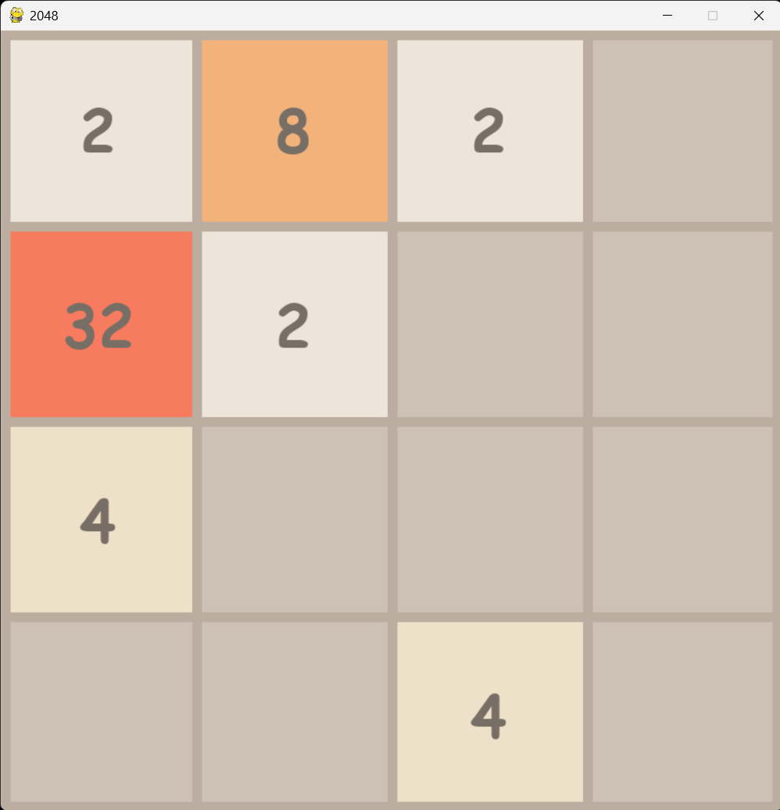
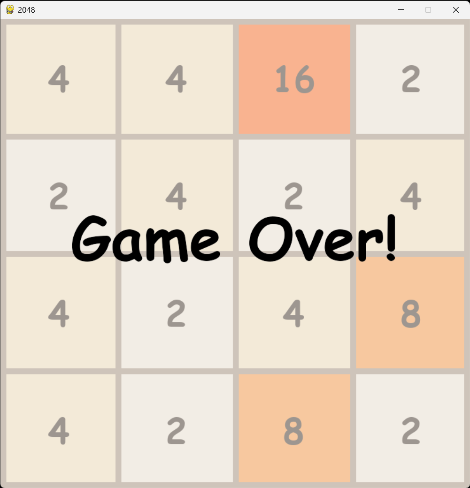

# 🎮 2048-Python-Game 
A simple Python implementation of the classic game **2048**, built using the **pygame** library.

## 🕹️ About the Game
**2048** is a popular sliding tile puzzle game. I built this version in Python for fun and as a programming challenge. 

## 📝 Game Rules
* Combine tiles with the same value to create a tile with twice the value. 
* Use the arrow keys (⬆️⬇️⬅️➡️) to slide tiles. 
* The goal is to reach the **2048** tile! 

## 📸 Screenshots




## 📥 Setup
1. Clone the repository:
    ```bash
    git clone https://github.com/Giovanni-Caruso/2048-Python-Game 
    cd 2048-Python-Game 
    ```

2. Create a Python 3.11.7 environment and install the library `pygame==2.6.0`:
    ```bash
    # with Anaconda
    conda create -n 2048 python=3.11.7
    conda activate 2048
    pip install pygame==2.6.0
    ```
  
